# CST8912_lab4# CST8912_LAB4

---

# CST8912 – Cloud Solution Architecture: Graded Lab Activity #4

## Overview

This lab involves setting up an Azure SQL database, configuring access and network settings, integrating with Azure Data Factory, and copying data from a SQL database to Azure Blob Storage. It aims to provide hands-on experience with cloud database services, data integration workflows, and troubleshooting common challenges in cloud resource management.

### Key Objectives:

- Design cloud architecture layers to maximize reliability and resiliency.
- Outline architectural components to meet various application needs.
- Implement highly available and elastically scalable solutions using cloud service models.
- Explore the main features of a cloud SQL database in Azure.

---

## Steps to Complete the Lab

### 1. Configure Azure SQL Database

Deploy an Azure SQL database in the Canada Central region within the resource group named cst8912-demo.
- Database name: db8912
- SQL Server: db8912demo
- Authentication: SQL authentication with your username and password.
- Choose "No" for SQL elastic pool.
- Set "Workload environment" to Development.
- Backup storage redundancy: Locally-redundant storage.

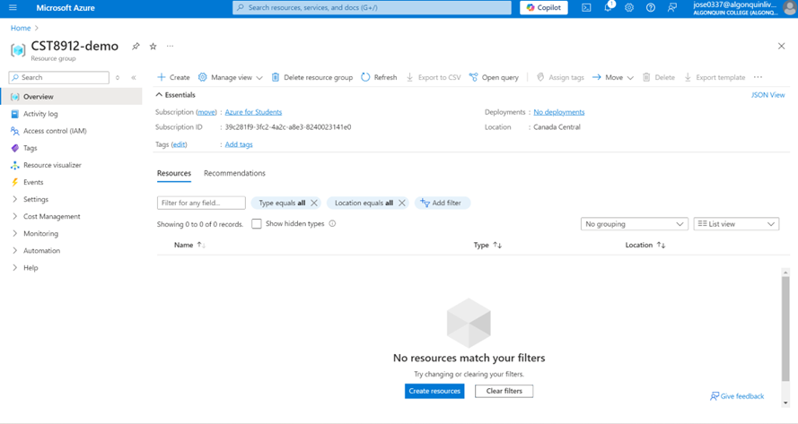
Figure 1: Overview of the resource group created.

### 2.Network Configuring

On the "Create SQL Database" page:
- Click on Next: Networking>.
- Select Public endpoint for network connectivity.
- Allow access from both Azure services and your current client IP.

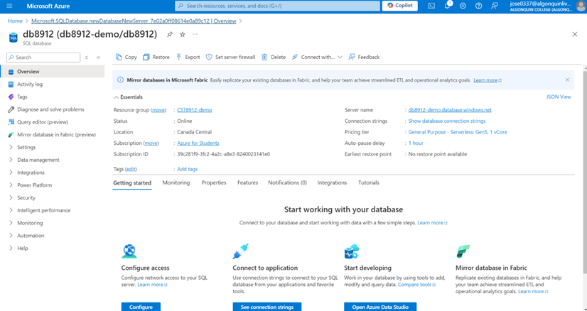
Figure 2: overview info for SQL database.

### 3. Enable Sample Data

In the "Additional Settings" tab, set the "Use existing data" option to Sample:
- This creates a sample database for exploration.
- Select Review + Create, then Create.

### 4. Query the Database

Log in using the SQL admin credentials and access the Query editor:
- Execute queries to explore the sample data.

sql
SELECT ProductID, Name, ListPrice, ProductCategoryID
FROM SalesLT.Product;

SELECT p.ProductID, p.Name AS ProductName,
        c.Name AS Category, p.ListPrice
FROM SalesLT.Product AS p
JOIN [SalesLT].[ProductCategory] AS c
    ON p.ProductCategoryID = c.ProductCategoryID;

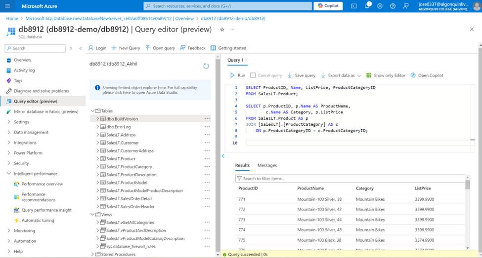
Figure 3: Image shows the output for running the query inside the data.

### 5. Create Azure Storage Account

Create a storage account with the default settings, then set up a container named productdata8912 within the storage account.

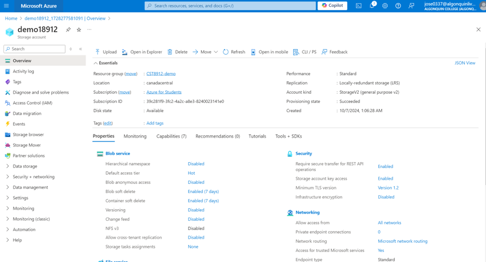
Figure 4: Overview of the storage account created.

### 6. Create and Configure Azure Data Factory

Deploy an Azure Data Factory and open its Data Factory Studio to begin managing and orchestrating data workflows.
- Choose to ingest data using a built-in copy task.
- Establish connections to both the Azure SQL Database and Azure Blob Storage.

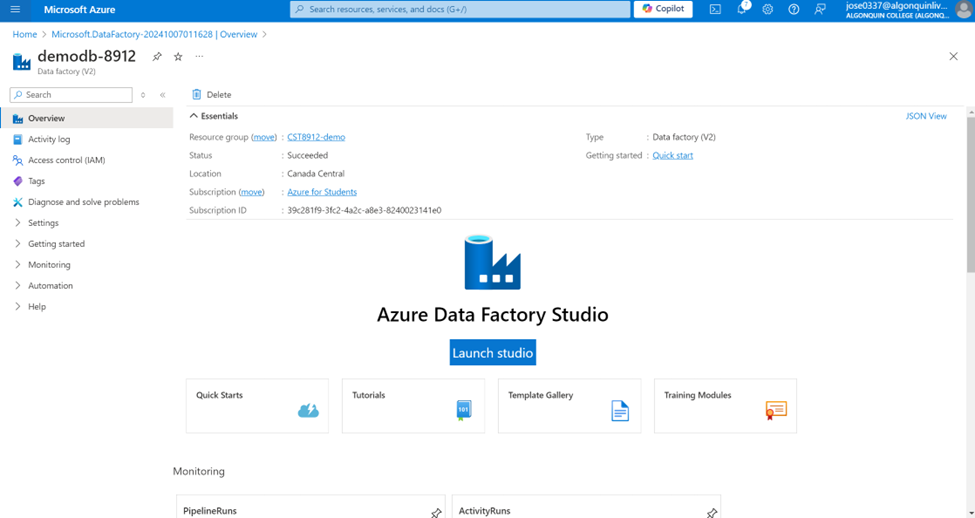
Figure 5: Image shows the setup of Azure Data Factory Service.

### 7. Choose Task Type and Cadence

- In the Azure Data Factory Studio, select the task type as a *built-in copy task*.
- Set the task cadence to *“Run once now”*.

---

### 8. Configure Source Type for Azure SQL Database

- Choose *Azure SQL Database* from the source type dropdown.
- Set up a new connection with the necessary configuration, then test the connection to ensure it's functioning correctly.

> *Note*: This step establishes a connection between Azure SQL Database and Azure Data Factory.

> *Note*: Use the correct database name and password created earlier for the SQL database.

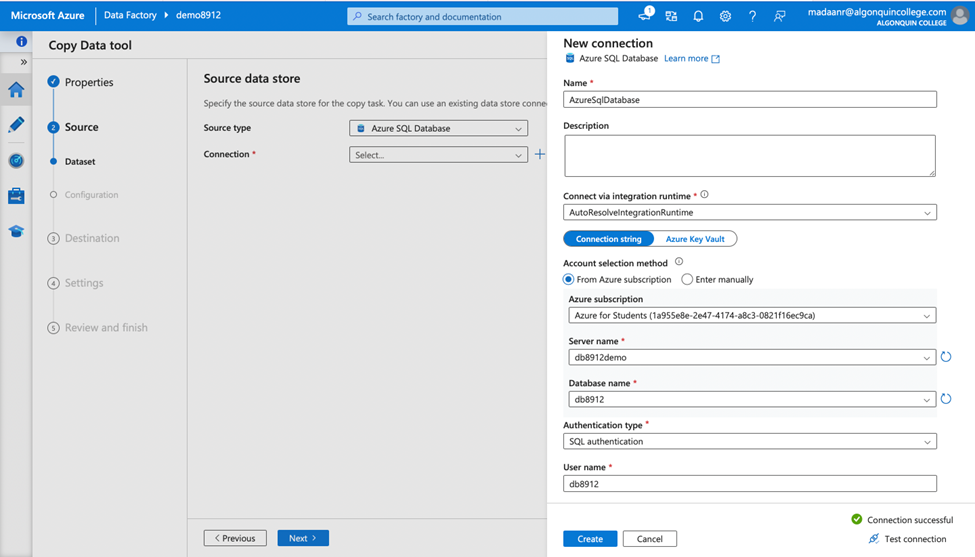
Figure 9: Image shows the sample SQL data available inside the data factory.

---

### 9. Select Source Table and Preview Data

- Choose the source table SalesLT.Product from the dropdown menu.
- Click *Next*, then preview the data to verify the selection.

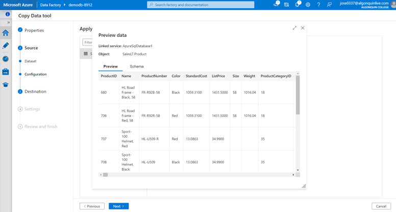
Figure 10: In Azure Data Factory, use the Preview Data option to view a sample of the data from the selected source, such as the SalesLT.Product table.

---

### 10. Configure Destination Type

- Click *Next, and choose the destination type as **Azure Blob Storage* from the dropdown.

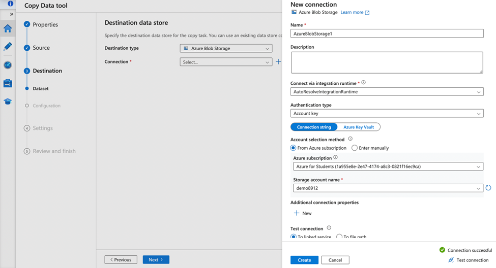
Figure 12: Image shows the selection of Azure Blob Storage as the destination type.

---

### 11. Create and Test Storage Account Connection

- Establish a new connection to the storage account, then test the connection to verify its functionality.
- Choose the *folder path* and specify the *file name*.

> *Note*: Ensure you use the correct storage account name created during the lab.

---

### 12. Choose Configuration

- Complete the configuration for the data copy task to ensure all settings are properly defined and ready for execution

---

### 13. Review and Complete the Pipeline

- Examine the pipeline settings, and then click Finish to complete the setup.
- Go to the storage account container to confirm that the product CSV file has been successfully copied from the database to the storage

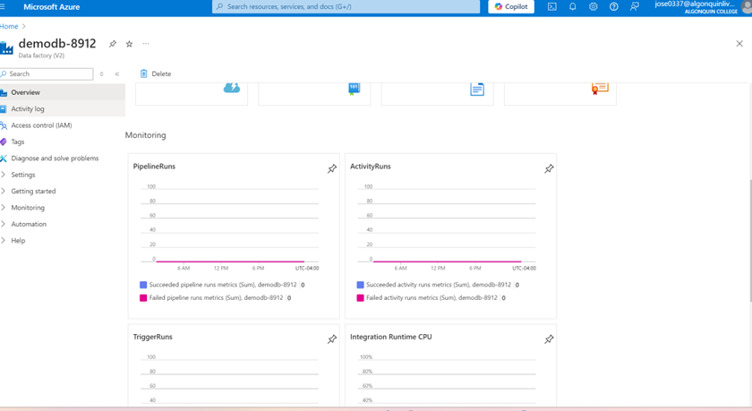
Figure 15: Image shows the overview of the data factory with pipeline information, including run status.

---

### 14. Verify Data in Storage Container

- Inspect the productdata8912 container to verify that the SalesLT.Product data has been successfully transferred from the Azure SQL database.

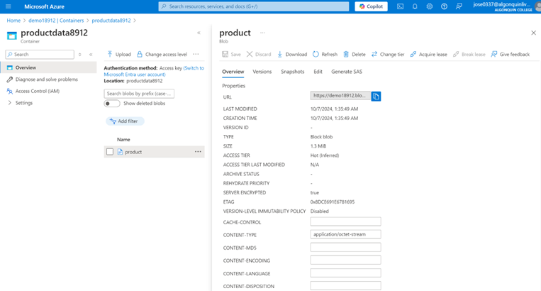
Figure 16: Image shows the productdata8912 container containing the SalesLT.Product data.

---

### 15. Cleanup

Deleting all resources created during the lab.

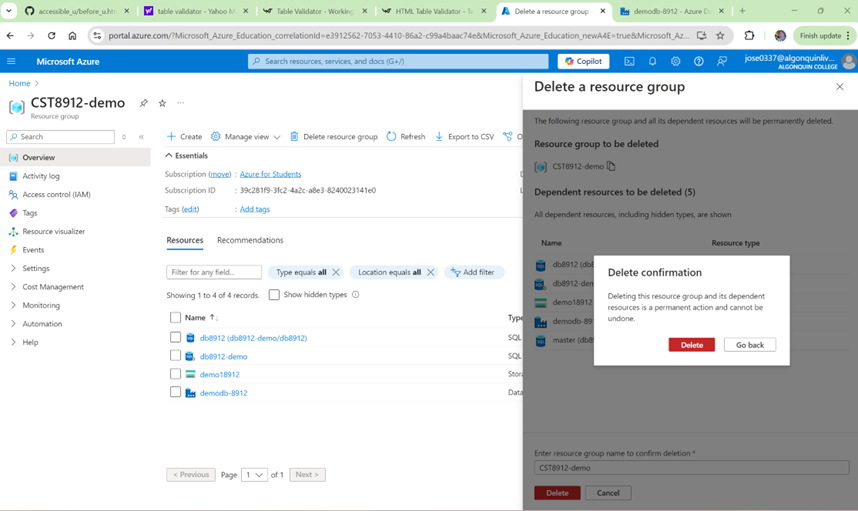
Figure 9: Image shows the deletion of all resources created for this lab project.

---

## Lab Report Summary

### Overview

During this lab, I investigated the deployment, configuration, and management of SQL databases on Microsoft Azure. By utilizing the Platform-as-a-Service (PaaS) model, the lab emphasized the advantages of automated management, scalability, and secure data access within cloud environments.

### Configuration of Azure SQL Database

Key elements included establishing a new database, managing access controls, and ensuring secure network connectivity. These steps highlighted the importance of balancing database security with accessibility.

### Azure Data Factory

Data integration workflows involving the transfer of data between Azure SQL Database and Azure Blob Storage were automated, which enhanced my knowledge of cloud-based data management.

### Conclusion

This lab enhanced my comprehension of managing cloud-based SQL databases and data integration workflows. The practical experience gained will be crucial for upcoming projects related to cloud solutions
